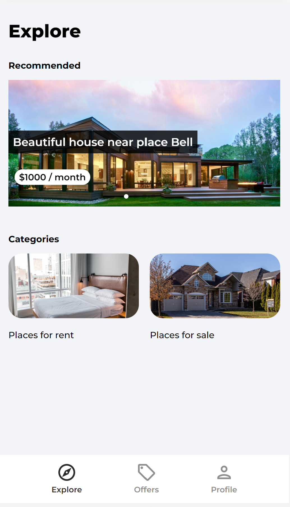

# [House Marketplace React App](https://house-marketplace-gevorgalaverdyan.vercel.app/)

## Description:
<ul>
    <li>This is a React / <a href=https://firebase.google.com>Firebase</a> v9 project</li>
    <li>Users can Create/Edit/Delete a listing and also view the other listings published by other landlords.</li>
    <li>The landlords can put the liting for Sale or for Rent.</li>
    <li>This project uses <a href=https://developers.google.com/maps>Google Maps API</a> in company of <a href=https://react-leaflet.js.org>React Leaflet</a> to display the listings' location on the map. </li>
    <li>This project also supports Google OAuth 2.0 to facilitate user SignIn and SignUp</li>
</ul>
 

## Features:
<b><i>Explore The Litings</i></b>

